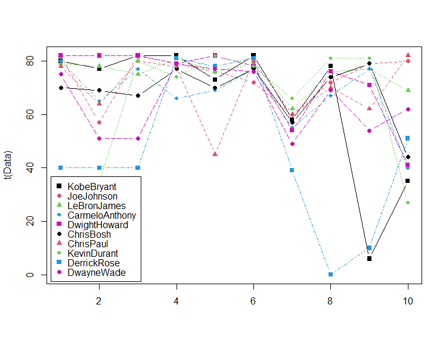
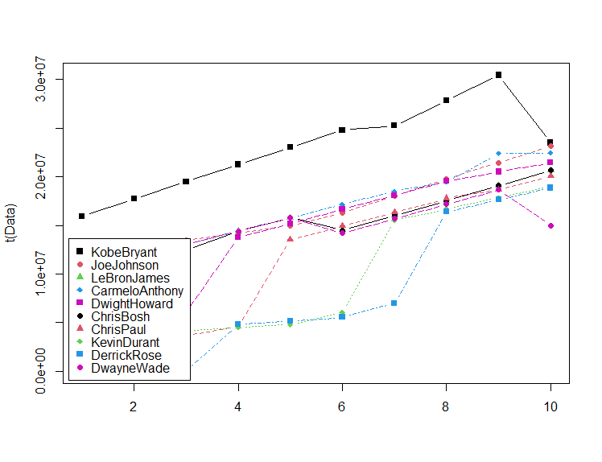
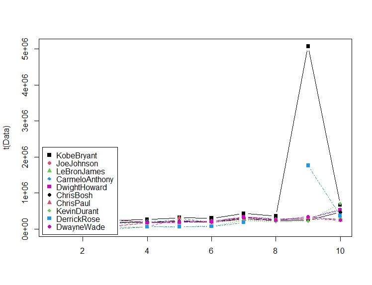
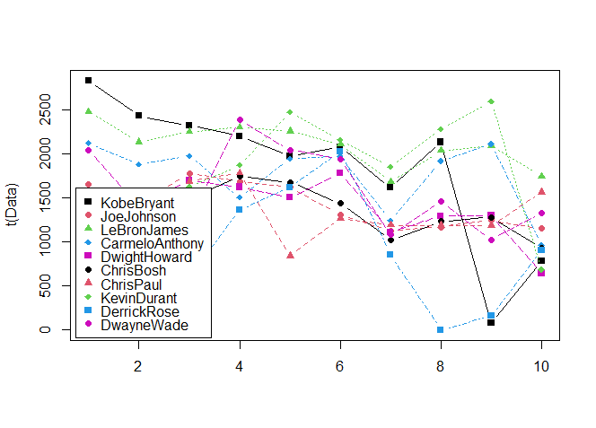
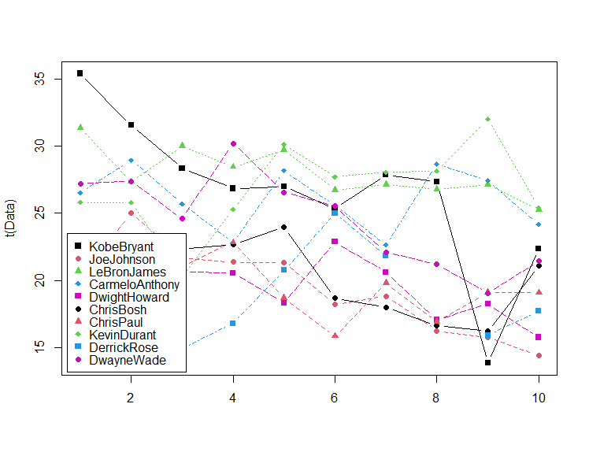
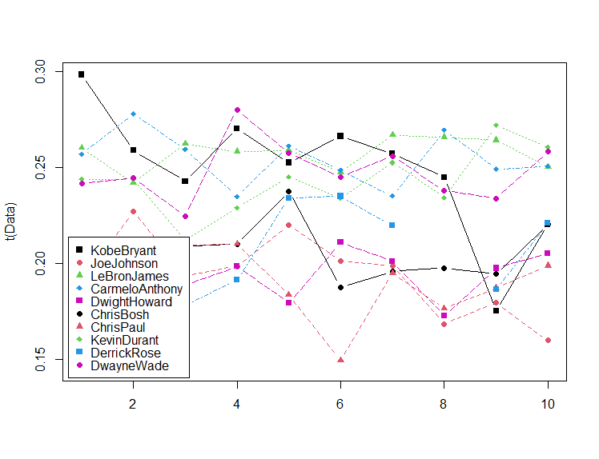
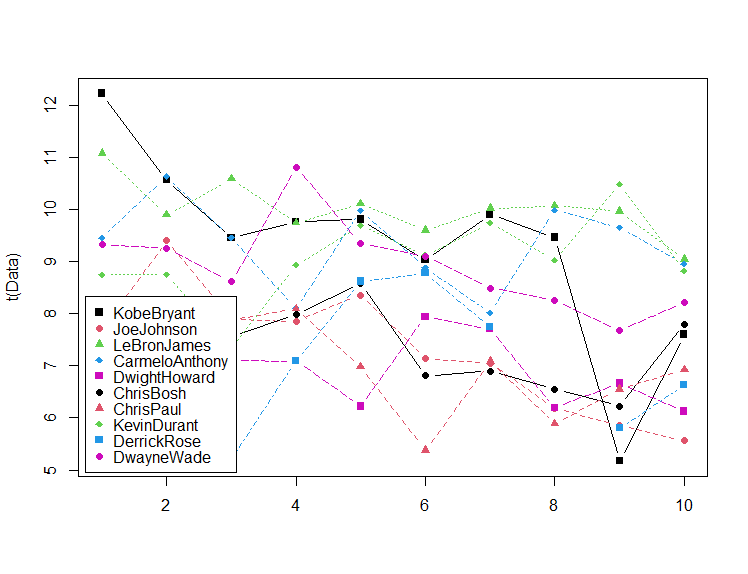
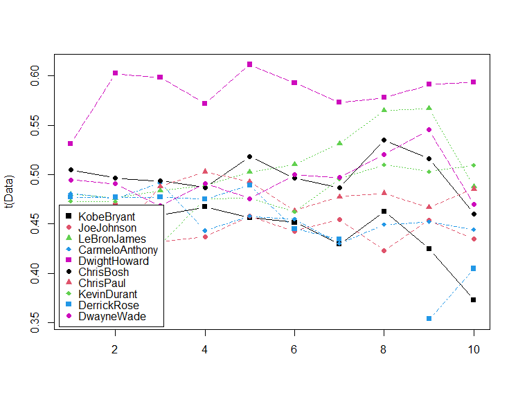

<div align="center">

[](https://www.r-project.org/)
[](https://www.rstudio.com/)
[](https://ggplot2.tidyverse.org/)

</div>

# Basketball Analysis with R 🏀

## Table of Contents
- [Introduction](#introduction)
- [Features](#features)
- [Technologies Used](#technologies-used)
- [Installation](#installation)
- [Usage](#usage)
- [Contributing](#contributing)


## Introduction
The Basketball Analysis with R project is aimed at analyzing basketball data to derive insights and patterns that can help improve team performance, player strategies, and overall game understanding. The project involves data collection, cleaning, exploratory data analysis (EDA), statistical modeling, and visualization.

## Features
- Data collection from various basketball databases and APIs
- Data preprocessing and cleaning
- Exploratory data analysis (EDA) to understand player and team statistics
- Statistical modeling to analyze player performance, team strategies, and game outcomes
- Visualization of basketball metrics using R's visualization libraries

## Technologies Used
The project is implemented using the following technologies:
- R Programming Language 📊
- RStudio IDE 🖥️
- Tidyverse (dplyr, ggplot2) 📈
- Basketball-specific R packages (e.g., nbaR, ncaaR) 🏀

## Installation
1. Install R and RStudio:
   - Download and install R from [CRAN](https://cran.r-project.org/)
   - Download and install RStudio from [RStudio's website](https://www.rstudio.com/products/rstudio/download/)
2. Clone the repository:
```bash
git clone https://github.com/your-username/basketball-analysis-r.git
```
3. Open the project in RStudio.
4. Install the required R packages by running the following commands in RStudio's console:
```bash
install.packages("ggplot2")
```
- Press Enter to execute the command.

- Wait for the installation to complete. R will download and install the ggplot2 package along with its dependencies.

- Once the installation is finished, you can load the ggplot2 package into your R session using the following command:
    ```bash
    library(ggplot2)
    ```
## Usage

Open the R scripts in RStudio and follow the instructions provided within each script.
Execute the R scripts to generate and explore various basketball metrics plots.
Analyze the insights derived from the visualizations.

## Plots
Here are some of the plots generated during the analysis:
- <h2> Games </h2>
<div align="center">
    
</div>

- <h2> Salary 💰</h2>
<div align="center">
    
</div>
 
- <h2>Salary per Game 🎮</h2>
<div align="center">
    
</div>

- <h2>Points 🏀</h2>
<div align="center">
    
</div>

- <h2>Player Style - Points per Games 🎯</h2>
<div align="center">
    
</div>

- <h2>Interesting Observations 🧐</h2>
<div align="center">
    
</div>

- <h2>Time is Valuable - Field Goals per Minute Played ⏱️</h2>
<div align="center">
    
</div>

- <h2>In-Game Metrics Normalized 📊</h2>
<div align="center">
    <div style="display: inline-block; margin-right: 20px;">
        
        <p>FieldGoals / Games</p>
    </div>
    <div style="display: inline-block;">
        
        <p>FieldGoals / FieldGoalAttempts</p>
    </div>
</div>

## Contributing

Contributions to the project are welcome! To contribute, follow these steps:

1. Fork the repository.
2. Create a new branch (git checkout -b feature/your-feature).
3. Make your changes and commit them (git commit -am 'Add your feature').
4. Push to the branch (git push origin feature/your-feature).
5. Create a new pull request.
